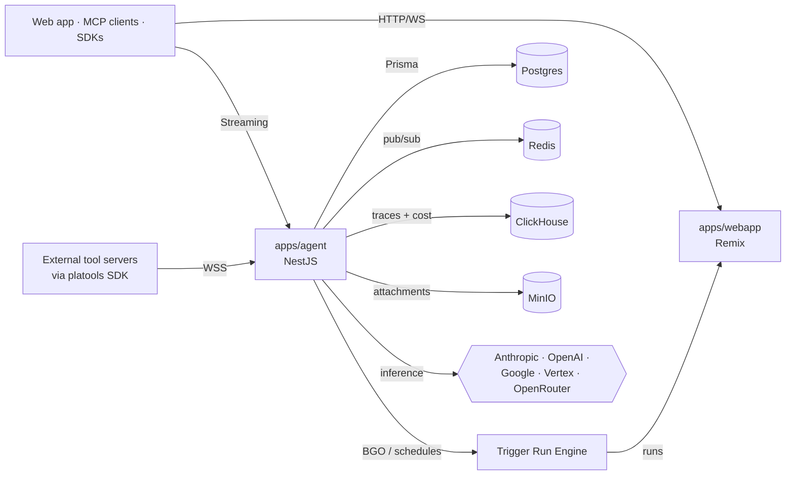

<div align="center">

# Platos

**The open-source agent runtime.**

Build, ship, and operate AI agents on infrastructure you own.
Apache 2.0. Self-hostable in one `docker compose up`.

[Docs](https://platos.dev/docs) ·
[Guides](https://platos.dev/guides) ·
[Quickstart](https://platos.dev/guides/quickstart) ·
[Roadmap](https://platos.dev/roadmap) ·
[Discord](https://discord.gg/7zxegt73zr)

</div>

---

## What is Platos?

Platos is a complete agent runtime — the open-source replacement for hosted services like Claude Managed Agents and OpenAI Assistants.

It bundles everything an agent needs to live in production:

- **Streaming chat runtime** with prompt caching, tool-calling, structured outputs, sub-agents, and multi-turn compaction.
- **Durable execution layer** built on top of [trigger.dev](https://trigger.dev) — every long-running tool call, scheduled job, or batch operation is a resumable run with retries, queues, and traces.
- **Universal MCP gateway** that federates four tool families (entity-pushed, native, skills, control plane) behind a single endpoint with OAuth scoping and per-tool ACL.
- **Memory + skills + observability** wired together at the runtime layer — vector store, knowledge graph, manifest-driven skills, OpenTelemetry traces, ClickHouse cost ledger.
- **Multi-tenant scope model** — every row is keyed by `(organizationId, projectId, environmentId)`. Build SaaS or run an internal platform; the same primitives fit both.
- **BYOK for every provider** — Anthropic, OpenAI, Google, Vertex AI, OpenRouter. Keys are encrypted in your database and never leave it.

You own the infra, the data, and the model choice. No vendor seat license, no telemetry-based billing, no lock-in.

## Quickstart

```bash
git clone https://github.com/winsenlabs/platos.git
cd platos
cp .env.example .env                       # set ANTHROPIC_API_KEY (or OPENAI_API_KEY, etc.)
docker compose -f docker-compose.platos.yml up -d
open http://localhost:3030                 # magic-link login → Agents → Create
```

Chat-ready in ~2 minutes. Full walkthrough: [platos.dev/guides/quickstart](https://platos.dev/guides/quickstart).

### Prerequisites

- Docker Desktop (or any Docker Engine 24+) with Compose v2
- 4 GB free RAM, 6 GB free disk
- An LLM provider API key (Anthropic recommended for first install)

### What you get

| Service | Port | Purpose |
|---|---|---|
| **webapp** | `3030` | Dashboard + REST API + auth |
| **agent** | `3100` | Streaming runtime, MCP gateway, tool dispatch |
| **postgres** | `5432` | State |
| **clickhouse** | `8123` | Telemetry + cost ledger |
| **redis** | `6379` | Cache, queues, pub/sub |
| **minio** | `9000` | Attachments, artifacts |

One compose file. All on your hardware.

## Architecture



Read the full architecture: [platos.dev/docs/architecture](https://platos.dev/docs/architecture).

### Repository layout

```
apps/
  agent/           NestJS streaming runtime + MCP gateway
  webapp/          Remix dashboard, public REST API, auth
  coordinator/     Run-engine coordination
  supervisor/      Worker supervision
  k8s-provider/    Kubernetes execution provider
  docker-provider/ Docker execution provider

packages/
  platos-client/   Official JS/TS SDK (agents, threads, streaming)
  platools-js/     SDK for building external tool entities (TypeScript)
  platools-py/     Same, for Python
  trigger-sdk/     Run-engine SDK
  core/            Shared core types + utilities

internal-packages/
  database/        Prisma schema + migrations
  clickhouse/      Telemetry + cost ledger schema
  run-engine/      Durable execution engine

references/
  entity-hello-world/        Minimal example: connect a tool entity
  entity-docs-mcp-bridge/    Bridge any external MCP server into Platos

content/
  docs/            User-facing reference docs (served by the public docs API)
  guides/          Task-oriented walkthroughs
```

## SDKs

```bash
npm install @platosdev/client      # JS / TS
pip install platos-client       # Python (coming soon)
```

```ts
import { PlatosClient } from "@platosdev/client";

const client = new PlatosClient({
  baseUrl: "https://your-platos-host.com",
  sessionToken: process.env.PLATOS_SESSION_TOKEN!, // mint on your backend
});

const thread = await client.threads.create(undefined, { agentId: "..." });
for await (const event of client.threads.send(thread.id, "Hello!")) {
  if (event.type === "token") process.stdout.write(event.text);
  if (event.type === "done") break;
}
```

[SDK reference →](https://platos.dev/docs/sdks)

## MCP

Platos ships an [MCP](https://modelcontextprotocol.io) gateway. Wire Claude Code, Cursor, or Claude Desktop to your runtime in one command:

```bash
claude mcp add platos https://your-platos-host.com/mcp/platform \
  --header "Authorization: Bearer $PLATOS_PAT"
```

Then call agents and tools directly from your editor. Per-entity MCP endpoints with OAuth 2.1 + DCR are also supported. Details: [platos.dev/docs/mcp-gateway](https://platos.dev/docs/mcp-gateway).

## Self-hosting

Production deploy guide with TLS, backups, observability, and scaling notes: [platos.dev/docs/self-hosting](https://platos.dev/docs/self-hosting).

We test against Postgres 16, ClickHouse 25.3, Redis 7, and MinIO. The compose file works on a $20 VPS for evaluation; production deployments scale horizontally on Kubernetes via the bundled Helm chart.

## Why we built this

The agent stack should be open and ownable. Most teams reach for hosted agent services and accept the trade — their conversations live elsewhere, their model choice is whatever the vendor ships, their data trains whatever the vendor wants. The teams that opt out spend three months rebuilding the plumbing themselves. We built Platos so neither group has to.

Read more: [platos.dev/about](https://platos.dev/about).

## Contributing

PRs welcome. Read [CONTRIBUTING.md](./CONTRIBUTING.md) for the dev setup, coding standards, and the changeset workflow.

A few things we care about:

- **Multi-tenant scope is sacred.** Every scoped row carries `(organizationId, projectId, environmentId)`. Don't bypass it.
- **Tests use real services, not mocks.** Vitest + testcontainers for everything that crosses a process boundary.
- **Conversations are encrypted at rest** (AES-256). Don't bypass the envelope.

## Community

- **Discord**: [discord.gg/7zxegt73zr](https://discord.gg/7zxegt73zr) — questions, RFCs, dogfooding stories
- **GitHub Discussions**: [github.com/winsenlabs/platos/discussions](https://github.com/winsenlabs/platos/discussions)
- **Issues**: [github.com/winsenlabs/platos/issues](https://github.com/winsenlabs/platos/issues)

## Built on

Platos stands on great open-source projects. Where we extend or specialize, we say so explicitly in the docs.

- **[trigger.dev](https://trigger.dev)** — durable run engine (Apache 2.0)
- **[Vercel AI SDK](https://sdk.vercel.ai)** — provider routing
- **[Model Context Protocol](https://modelcontextprotocol.io)** — Anthropic's open tool spec
- **Postgres · ClickHouse · Redis · MinIO** — the boring, reliable parts

## Security

If you've found a vulnerability, please email **hello@winsenlabs.com** rather than opening a public issue. Full policy: [SECURITY.md](./SECURITY.md).

## License

[Apache 2.0](./LICENSE). Use it, fork it, ship it. Maintained by [Winsen Labs](https://winsenlabs.com).
