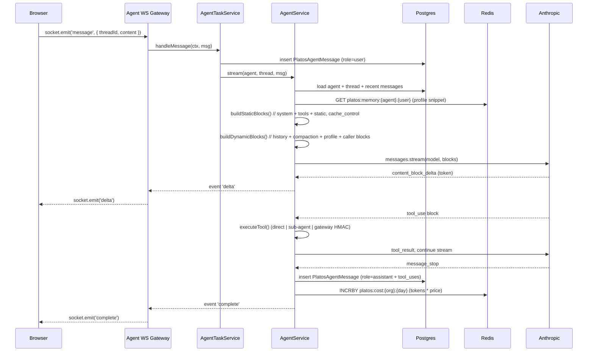
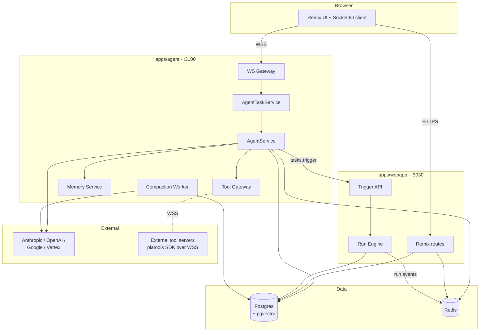

# Platos Architecture

Platos runs as two first-class Node services plus Postgres and Redis. This doc explains what each service does, why they're split, how a message flows end-to-end, the Prisma schema additions, and the Redis key layout. Read this if you're self-hosting, contributing, or debugging a production issue.

## Services

| Service | Tech | Port | Responsibility |
|---|---|---|---|
| `apps/webapp` | Remix + Node | 3030 | Dashboard UI, REST/tRPC API, trigger.dev run engine, auth, billing, schedules, batches, deployments |
| `apps/agent` | NestJS | 3100 | Real-time agent runtime, Socket.IO, LLM streaming, tool gateway, approvals, compaction, user profiling |

Both share a Postgres (Prisma schema in `internal-packages/database`) and a Redis instance.

### Why split?

1. **Different workloads.** Remix serves HTML + API in ~50ms request budgets. The agent service holds persistent WebSockets, streams LLM tokens for 30+ seconds, and runs long sub-agent loops. Mixing them means one noisy agent starves the dashboard.
2. **Different scaling profile.** Webapp scales on RPS. Agent scales on concurrent streams. You size them independently and set sticky sessions on the agent only.
3. **Different languages of concern.** Webapp lifecycle is request/response. Agent lifecycle is event-driven (NestJS is the right fit — modules, DI, WebSocket gateways, lifecycle hooks are idiomatic).
4. **Blast radius.** A segfault in a streaming tool call shouldn't take down the dashboard. Separate processes, separate crash domains.

Both services use the same Prisma client (generated from the shared schema in `internal-packages/database`) so there's no data-layer duplication.

## Message lifecycle

The happy path for a user turn, step by step:



A few details worth calling out:

- **Cache breakpoint.** `buildStaticBlocks()` is deterministic for a given `(agent, enabledTools)` tuple and always emits the same bytes. Anthropic keys the cache on this prefix, so turn 2+ within 5 minutes hits the cache at ~90% discount on input tokens.
- **Compaction.** If `thread.messagesCount > agent.compactThreshold` and `historyMode = 'compact'`, we fire a background Haiku summarization job the turn **before** the threshold is crossed, store the result on `thread.compactedSummary`, and from that turn onward we replace the oldest N messages with the summary in `buildDynamicBlocks`.
- **Tool execution.** Depending on `agent.toolMode`:
  - `direct` — tool schemas live in the main LLM call. Up to ~50 tools before schema bloat kills you.
  - `sub-agent` — main LLM only sees one tool: `run_subagent(query)`. A separate Haiku-powered sub-agent gets all schemas and returns consolidated results. Scales to 1000+ tools.
  - `execute-tool` — main LLM sees two meta-tools: `find_tools(query)` (BM25 over the tool matrix) and `execute_tool(name, args)`. For open-ended registries.
- **Events on the wire.** `delta`, `tool_use_start`, `tool_use_end`, `approval_required`, `approval_resolved`, `compaction_started`, `complete`, `error`. All JSON, all documented in `apps/agent/src/streaming/events.ts`.

## Data flow



Key flows:

- **UI → Agent** for streaming messages (WebSocket).
- **UI → Webapp** for everything else (agent CRUD, run inspection, settings).
- **Agent → Webapp** for `tasks.trigger` (durable task spawning via `@trigger.dev/sdk`).
- **Agent ↔ External tool servers** over WSS, HMAC-signed.

## Database schema (Platos additions)

All additions live in `internal-packages/database/prisma/schema.prisma` under a `// Platos agent layer` section. They do not modify existing trigger.dev tables.

### `PlatosAgent`

One row per configured agent.

```prisma
model PlatosAgent {
  id              String   @id @default(cuid())
  organizationId  String
  name            String
  provider        String   // 'anthropic' | 'openai' | 'google' | 'vertex'
  model           String   // e.g. 'claude-sonnet-4-6'
  systemPrompt    String   @db.Text
  toolMode        String   @default("direct")      // 'direct' | 'sub-agent' | 'execute-tool'
  historyMode     String   @default("compact")     // 'full' | 'compact'
  compactThreshold Int     @default(40)
  enabledTools    Json     @default("[]")          // array of ToolDefinition.id
  perToolPerms    Json     @default("{}")          // { toolId: { requiresApproval, destructive } }
  staticBlocks    Json     @default("[]")          // [{ key, content }]
  autoInjectProfile Boolean @default(false)
  createdAt       DateTime @default(now())
  updatedAt       DateTime @updatedAt

  threads   PlatosAgentThread[]
  profiles  PlatosAgentUserProfile[]

  @@index([organizationId])
}
```

### `PlatosAgentThread`

One per conversation. Holds compaction state.

```prisma
model PlatosAgentThread {
  id                 String   @id @default(cuid())
  agentId            String
  userId             String
  title              String?
  messagesCount      Int      @default(0)
  compactedSummary   String?  @db.Text
  compactedUpto      Int      @default(0)   // message index included in summary
  lastMessageAt      DateTime?
  createdAt          DateTime @default(now())

  agent    PlatosAgent         @relation(fields: [agentId], references: [id], onDelete: Cascade)
  messages PlatosAgentMessage[]

  @@index([agentId, userId])
  @@index([userId])
}
```

### `PlatosAgentMessage`

One per turn. `content` is the full provider-native block array so tool_use/tool_result round-trips faithfully.

```prisma
model PlatosAgentMessage {
  id         String   @id @default(cuid())
  threadId   String
  role       String   // 'user' | 'assistant' | 'tool'
  content    Json     // provider-native content blocks
  toolUses   Json     @default("[]")
  cacheStats Json?    // { cacheCreationInputTokens, cacheReadInputTokens, ... }
  runId      String?  // trigger.dev run id, if any
  createdAt  DateTime @default(now())

  thread PlatosAgentThread @relation(fields: [threadId], references: [id], onDelete: Cascade)

  @@index([threadId, createdAt])
}
```

### `PlatosAgentUserProfile`

Per-agent-per-user key/value profile. See [user-profiling.md](./user-profiling.md).

```prisma
model PlatosAgentUserProfile {
  agentId   String
  userId    String
  key       String
  value     String   @db.Text
  updatedAt DateTime @updatedAt

  agent PlatosAgent @relation(fields: [agentId], references: [id], onDelete: Cascade)

  @@id([agentId, userId, key])
}
```

### Tool matrix

```prisma
model ToolDefinition {
  id          String   @id @default(cuid())
  name        String   @unique
  namespace   String   // e.g. 'github', 'linear'
  description String   @db.Text
  inputSchema Json
  version     String   @default("1")
  createdAt   DateTime @default(now())

  mappings OrgToolMapping[]
  health   ToolHealth[]
  @@index([namespace])
}

model OrgToolMapping {
  organizationId String
  toolId         String
  enabled        Boolean @default(true)
  callbackUrl    String
  hmacSecret     String  // encrypted
  createdAt      DateTime @default(now())

  tool ToolDefinition @relation(fields: [toolId], references: [id], onDelete: Cascade)
  @@id([organizationId, toolId])
}

model ToolHealth {
  toolId          String
  organizationId  String
  lastCheckAt     DateTime
  status          String   // 'healthy' | 'degraded' | 'down'
  p95LatencyMs    Int?
  errorRate       Float?

  tool ToolDefinition @relation(fields: [toolId], references: [id], onDelete: Cascade)
  @@id([toolId, organizationId])
}
```

Why three tables instead of one? Multi-tenant realities: the **definition** is shared (same schema, same docs), the **mapping** is per-org (is it enabled, where to POST), and **health** is high-churn (updated every ping). Split lets us index cleanly and lets orgs enable/disable without duplicating schemas.

## Redis key layout

All Platos keys are prefixed `platos:`. Everything TTL'd unless otherwise noted.

| Prefix | Purpose | TTL |
|---|---|---|
| `platos:agent:stream:{runId}` | Streaming buffer for resumable streams | 15 min |
| `platos:agent:lock:{threadId}` | Single-writer lock for a thread | 5 min |
| `platos:agent:events:{threadId}` | Pub/sub channel, fan-out to multiple UI tabs | (channel) |
| `platos:cost:{orgId}:{YYYY-MM-DD}` | Daily token cost counter (cents * 10000) | 90 days |
| `platos:cost:tokens:{orgId}:{YYYY-MM-DD}:{model}` | Per-model token counter | 90 days |
| `platos:cred:{orgId}:{provider}` | Cached decrypted provider key | 15 min |
| `platos:memory:{agentId}:{userId}` | Cached user profile snippet (pre-formatted) | 5 min |
| `platos:memory:{agentId}:{userId}:keys` | Set of known keys for `recall_user_profile()` | 5 min |
| `platos:approval:pending:{approvalId}` | Pending approval payload | 5 min |
| `platos:approval:result:{approvalId}` | BLPOP target for approval resolution | 5 min |
| `platos:approval:channel:{orgId}` | Pub/sub for approval fan-out to UIs | (channel) |
| `platos:tools:gateway:{orgId}` | Set of connected tool-server socket IDs | (no TTL; managed) |
| `platos:tools:bm25:{orgId}` | Serialized BM25 index for `find_tools` | 1 hr |

The cost counters are read by the billing worker every 15 minutes to roll up into Postgres. If Redis goes away, you lose the last 15 minutes of cost data but not the tokens (they're also recorded on `PlatosAgentMessage.cacheStats`).

## What's upstream-untouched

Everything under `apps/webapp/app/v3/`, the run engine (`internal-packages/run-engine`), and the CLI are unchanged from trigger.dev. Platos adds files next to them; it doesn't modify them. See [upgrading-from-trigger.md](./upgrading-from-trigger.md) for the full list of what changed.

## Where to look next

- How messages get built and cached: `apps/agent/src/agent-runtime/agent.service.ts`
- WebSocket wire protocol: `apps/agent/src/streaming/gateway.ts`
- Tool matrix + BM25: `apps/agent/src/tool-gateway/`
- Compaction worker: `apps/agent/src/memory/compaction.service.ts`
- Durable task bridge: `apps/agent/src/trigger-bridge/`
