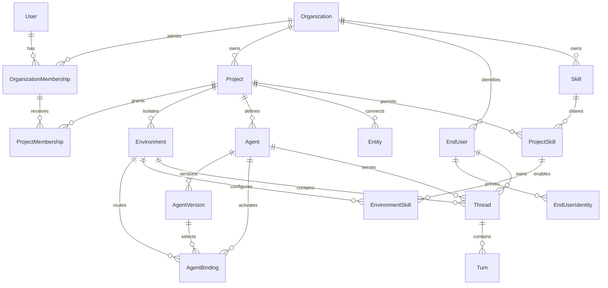

# Platos tenancy model

Platos owns its tenancy. The canonical hierarchy is **Organization → Project → Environment**. Trigger is an external runtime integration and has no tenancy tables or authorization role inside Platos.

This design uses one canonical ownership foreign key per record. Parent scope is derived through that foreign key instead of copying `(organizationId, projectId, environmentId)` onto every table.

## Chosen model

### Organization

An **Organization** is the tenant, billing boundary, and root security boundary. It owns operator membership, organization policy, credentials intended for organization-wide use, end-user identities, and projects.

A global `User` becomes an operator only through an `OrganizationMembership`. Organization roles are `owner`, `admin`, and `member`; ownership is explicit rather than inferred from the oldest administrator.

### Project

A **Project** is an organization-owned grouping and human access boundary for related agents, entities, skills, and resources. It earns its place because organizations need independent teams, resource namespaces, and policy scopes without creating separate billing tenants.

`ProjectMembership` grants an organization member `admin`, `editor`, or `viewer` access. Organization owners and admins may administer every project; ordinary organization members receive no project access merely by belonging to the organization.

### Environment

An **Environment** is a project-owned isolation boundary for credentials, configuration, data, connected-entity bindings, traffic, runtime policy, and audit data. It is not a code-deployment stage. Names such as `development`, `preview`, and `production` are operator conventions only.

Human access inherits from the project. Environments do not have a second membership system. Service credentials and end-user sessions are explicitly pinned to one environment, so an environment remains a hard data and execution boundary even though operator authorization is inherited.

Agent identity belongs to a project. `AgentVersion` is immutable configuration, and `AgentBinding` selects the active and optional canary versions for an environment. This separates “what the agent is” from “which version receives traffic here” without introducing Trigger's Deployment noun.

### End users

An **EndUser** is organization-owned and is never an operator. The same person may interact with multiple agents or environments without being duplicated. `EndUserIdentity` keys an identity by organization, issuer/installation, channel, and subject; a channel-native identifier alone is not globally unique.

A `Thread` belongs to one environment, agent, and end user. This is the authorization join: end-user principals can reach only threads whose `endUserId`, `environmentId`, and allowed `agentId` match their verified session claims. Organization ownership of `EndUser` grants no cross-project access by itself.

## Entity relationship diagram

## Security boundaries

| Level or principal | Boundary | Authorization rule |
| --- | --- | --- |
| `User` | Authentication identity only | A user has no tenant authority without an active organization membership. |
| Organization | Tenant, billing, membership, and policy | `owner` controls ownership and deletion; `admin` manages members/projects/policy; `member` receives only explicit project grants. |
| Project | Operator access and resource namespace | `admin` manages membership/policy, `editor` changes resources, and `viewer` reads operator surfaces. Organization owner/admin overrides are explicit. |
| Environment | Data, credential, traffic, runtime-policy, and audit isolation | Operator rights inherit from Project. Every service token, end-user session, and runtime request is pinned to one environment. No environment may reference a resource from another project. |
| Operator principal | Control plane | Derived from a verified user session plus memberships. May access only authorized projects; mutating and secret-bearing surfaces enforce role thresholds. |
| End-user principal | Data plane | Derived from a verified entity/platform session. May invoke allowed agents and access only its own threads, turns, artifacts, and approvals; never configuration, credentials, aggregate monitoring, or other users' data. |
| Service principal | Machine-to-machine data plane | Credential stores one environment and a permission set. Scope is loaded from the credential record, never accepted from caller headers. |
| Internal runtime call | Trusted transport, not implicit authority | Signed internal requests carry a principal ID; the receiving service reloads scope and authorization. A valid internal signature does not turn an end user into an operator. |

### Enforcement invariants

1. Request scope is resolved from authenticated records; caller-supplied organization/project/environment headers are never authoritative.
2. Parentage is checked by foreign keys: an Environment references one Project and a Project references one Organization.
3. A record stores only its canonical owner FK. Authorization joins through the parent chain; redundant scope IDs may exist only in derived read models or observability events, never as independent authorities.
4. If a denormalized parent ID is added for query performance, the write path derives it and a database constraint or trigger verifies it. It is not accepted from an API request.
5. End-user and operator identities are separate tables and principal types. No matching email, external ID, or display name upgrades an end user to an operator.
6. Soft deletion revokes sessions and credentials immediately. Historical audit identity may remain pseudonymized according to the privacy model.

## Why Project remains

Project is not a label on Organization. It supplies:

- an operator access boundary for independent teams;
- stable namespaces for agents, entities, and skills;
- a parent for multiple isolated environments;
- a policy and quota aggregation level below billing; and
- a unit that can be archived without deleting the organization.

Without Project, every resource would be organization-global or would need ad hoc grouping and ACL columns, recreating Project poorly across many tables.

## Environment semantics

Environment remains because versioning and isolation solve different problems:

- `AgentVersion` answers **which immutable configuration is this?**
- `AgentBinding` answers **which version receives traffic in this environment?**
- `Environment` answers **which credentials, data, entities, policies, and traffic may interact?**

Promotion changes an `AgentBinding`; it does not copy an agent or deploy code. Canary routing selects between two Agent Versions within one Environment.

## Current foreign-key disposition

A mechanical audit of `internal-packages/database/prisma/schema.prisma` found **42** direct Prisma relations from `Platos*` models into inherited tenancy: 30 to `RuntimeEnvironment`, 6 to `Organization`, and 6 to `Project`. The earlier 40 count omitted the two optional `PlatosSkill.project` and `PlatosSkill.environment` relations. All 42 are mapped below.

“Derived” means the direct FK is removed and scope is reached through the named canonical owner.

### Current Organization relations — 6

| Current relation | New home | Disposition |
| --- | --- | --- |
| `PlatosAgent.organization` | `Agent.project → Project.organization` | Remove duplicate Organization FK; Agent is project-owned. |
| `PlatosAgentThread.organization` | `Thread.environment → Project.organization` | Remove duplicate Organization FK; Thread is environment-owned. |
| `PlatosAgentArtifact.organization` | `Artifact.environment → Project.organization` | Remove duplicate Organization FK; Artifact is environment-owned. |
| `PlatosMessageAttachment.organization` | `MessageAttachment.environment → Project.organization` | Remove duplicate Organization FK; attachment is environment-owned. |
| `PlatosConnectedEntity.organization` | `Entity.project → Project.organization` | Remove duplicate Organization FK; Entity is project-owned. |
| `PlatosSkill.organization` | `Skill.organizationId` | Keep one direct Organization FK for the reusable tenant-owned definition. |

### Current Project relations — 6

| Current relation | New home | Disposition |
| --- | --- | --- |
| `PlatosAgent.project` | `Agent.projectId` | Keep as Agent's canonical owner. |
| `PlatosAgentThread.project` | `Thread.environment → Environment.project` | Remove duplicate Project FK. |
| `PlatosAgentArtifact.project` | `Artifact.environment → Environment.project` | Remove duplicate Project FK. |
| `PlatosMessageAttachment.project` | `MessageAttachment.environment → Environment.project` | Remove duplicate Project FK. |
| `PlatosConnectedEntity.project` | `Entity.projectId` | Keep as Entity's canonical owner. |
| `PlatosSkill.project` | `ProjectSkill.projectId` | Replace nullable scope FK with an explicit project availability row. |

### Current RuntimeEnvironment relations — 30

| Current relation | New home | Disposition |
| --- | --- | --- |
| `PlatosAgent.environment` | `AgentBinding.environmentId` | Agent is project-owned; explicit binding selects versions per environment. |
| `PlatosAgentCluster.environment` | `AgentCluster.environmentId` | Keep Environment ownership. |
| `PlatosEndUser.environment` | `EndUser.organizationId` via the old environment's parent chain | Replace Environment ownership; Thread remains the environment-specific authorization join. |
| `PlatosAccessKey.environment` | `Credential.environmentId` | Re-home into the unified environment-scoped credential model. |
| `PlatosPostmanTemplate.environment` | `PostmanTemplate.environmentId` | Keep Environment ownership. |
| `PlatosAgentThread.environment` | `Thread.environmentId` | Keep as Thread's canonical owner. |
| `PlatosAgentArtifact.environment` | `Artifact.environmentId` | Keep as Artifact's canonical owner. |
| `PlatosMessageAttachment.environment` | `MessageAttachment.environmentId` | Keep as attachment's canonical owner. |
| `PlatosEntityToolMapping.environment` | `EnvironmentEntityTool.environmentId` | Keep explicit environment enablement/configuration. |
| `PlatosToolHealth.environment` | `ToolHealth.environmentId` | Keep Environment ownership. |
| `PlatosToolCallAudit.environment` | `ToolCallAudit.environmentId` | Keep Environment ownership. |
| `PlatosAdminAudit.environment` | `AdminAudit.environmentId` | Keep Environment ownership; organization/project can be derived. |
| `PlatosAgentApproval.environment` | `AgentApproval.environmentId` | Keep Environment ownership. |
| `PlatosProviderEnabled.environment` | `EnvironmentProvider.environmentId` | Keep explicit provider enablement per environment. |
| `PlatosProviderKey.environment` | `Credential.environmentId` | Re-home provider secrets into the unified credential model. |
| `PlatosBudgetCap.environment` | `Budget.environmentId` | Keep Environment ownership. |
| `PlatosSafetyEvent.environment` | `SafetyEvent.environmentId` | Keep Environment ownership. |
| `PlatosMessageRating.environment` | `MessageRating.environmentId` | Keep Environment ownership. |
| `PlatosEvalCriterion.environment` | `EvalCriterion.environmentId` | Keep Environment ownership. |
| `PlatosAgentEval.environment` | `AgentEval.environmentId` | Keep Environment ownership. |
| `PlatosGoldenSet.environment` | `GoldenSet.environmentId` | Keep Environment ownership. |
| `PlatosTask.environment` | `Job.environmentId` | Rename to the ratified Job model; keep Environment ownership. |
| `PlatosSkill.environment` | `EnvironmentSkill.environmentId` | Replace nullable scope FK with explicit environment enablement/configuration. |
| `PlatosMemory.environment` | `Memory.environmentId` | Keep Environment ownership. |
| `PlatosMemoryEntity.environment` | `MemoryEntity.environmentId` | Keep Environment ownership. |
| `PlatosMemoryRelationship.environment` | `MemoryRelationship.environmentId` | Keep Environment ownership. |
| `PlatosMCPToken.environment` | `Credential.environmentId` | Re-home into unified credentials with explicit permissions. |
| `PlatosOrgMcpPolicy.environment` | `OrganizationMcpPolicy.organizationId` | Correct the scope/name mismatch; environment overrides, if needed, use a separate `EnvironmentMcpPolicy`. |
| `PlatosEvent.environment` | `Event.environmentId` | Keep Environment ownership. |
| `PlatosNotificationRule.environment` | `NotificationRule.environmentId` | Keep Environment ownership. |

## Rejected alternatives

### Clone the current scope tuple

Rejected. Copying three ownership FKs onto most tables preserves the coupling and permits contradictory parent tuples. Clean-slate records instead point to their lowest real owner and derive ancestors.

### Remove Project and group with labels

Rejected. Labels cannot enforce membership, namespace uniqueness, archive behavior, quotas, or environment parentage. Those needs would recreate Project in scattered ACL and metadata fields.

### Remove Environment and use Agent Version channels

Rejected. Versions select agent configuration; they do not isolate provider keys, entities, end-user sessions, data, budgets, or audit logs. Conflating rollout with isolation would make credentials and data follow an agent version.

### Fix Environment to development/staging/production

Rejected. Platos promotes agent versions, not code artifacts. Operators may use those names, but the schema does not assign lifecycle meaning to them.

### Add EnvironmentMembership

Rejected. A second human membership hierarchy creates conflicting grants and expensive authorization reasoning. Project membership controls operators; Environment pins data-plane sessions and credentials.

### Keep EndUser environment-owned

Rejected. It duplicates one person across environments and makes identity linking and erasure inconsistent. Organization ownership provides one identity record, while environment-owned Threads enforce data access.

### Make all resources organization-owned

Rejected. It destroys project team isolation and makes environment scope an unenforced tag. Ownership follows the narrowest stable boundary that controls the resource.
