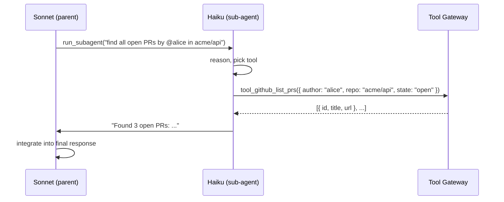

# Writing Agents

Three worked examples — a support bot, a research agent that spawns durable tasks, and a 100-tool sub-agent configuration. For each, you'll see the system prompt, the full config, how to test it, and a sample conversation. Copy, tweak, ship.

All examples assume you've run [quickstart.md](./quickstart.md) and can log into a local Platos.

---

## Example 1 — Support bot (3 tools, direct mode)

The simplest useful agent. Sonnet 4.6, three hardcoded tools, no sub-agents, no spawned tasks.

### System prompt

```
You are a customer support agent for Acme Corp, a B2B analytics platform.

Guidelines:
- Be concise. Customers are busy.
- Confirm account details before making changes.
- If you don't know, say so and offer to escalate by creating a ticket.
- Never promise a refund — always use request_approval for refunds.

When a customer asks about their account, call lookup_account first.
When they want to update contact info, use update_account after confirming.
When something breaks, call create_ticket with severity.
```

### Config (create via UI or SDK)

```ts
import { PlatosClient } from "@platos/sdk";

const client = new PlatosClient({
  apiKey: process.env.PLATOS_API_KEY!,
  baseUrl: "http://localhost:3030",
});

await client.agents.create({
  name: "Acme Support",
  provider: "anthropic",
  model: "claude-sonnet-4-6",
  toolMode: "direct",
  historyMode: "compact",
  compactThreshold: 40,
  systemPrompt: /* the prompt above */,
  autoInjectProfile: true,
  tools: [
    {
      name: "lookup_account",
      description: "Return account details for a given email.",
      inputSchema: {
        type: "object",
        properties: { email: { type: "string" } },
        required: ["email"],
      },
      callbackUrl: "https://internal.acme.com/platos/lookup_account",
    },
    {
      name: "update_account",
      description: "Update contact info (name, phone, billing email).",
      inputSchema: {
        type: "object",
        properties: {
          email: { type: "string" },
          field: { type: "string", enum: ["name", "phone", "billing_email"] },
          value: { type: "string" },
        },
        required: ["email", "field", "value"],
      },
      callbackUrl: "https://internal.acme.com/platos/update_account",
      requiresApproval: false,
      destructive: true,
    },
    {
      name: "create_ticket",
      description: "File a support ticket.",
      inputSchema: {
        type: "object",
        properties: {
          email: { type: "string" },
          severity: { type: "string", enum: ["low", "normal", "high", "urgent"] },
          summary: { type: "string" },
        },
        required: ["email", "severity", "summary"],
      },
      callbackUrl: "https://internal.acme.com/platos/create_ticket",
    },
  ],
});
```

### Test

Chat in the UI or via SDK:

```ts
const thread = await client.threads.create({ agentId: "agt_..." });
const stream = client.messages.stream(thread.id, {
  content: "Hi, I can't log in. Email is jane@widgets.io",
});
for await (const event of stream) {
  if (event.type === "delta") process.stdout.write(event.text);
}
```

### Sample conversation

```
User:   Hi, I can't log in. Email is jane@widgets.io
Agent:  [tool_use] lookup_account({ email: "jane@widgets.io" })
        [tool_result] { status: "active", mfa: true, last_login: "2024-09-10" }
        Your account is active with MFA enabled. When you enter your password,
        do you get a "wrong password" error or does the MFA code fail?

User:   MFA code fails.
Agent:  [tool_use] create_ticket({
          email: "jane@widgets.io",
          severity: "high",
          summary: "MFA code rejected on login"
        })
        [tool_result] { ticketId: "TKT-4812" }
        Filed ticket TKT-4812. Our auth team will reach out within 2 hours.
        Meanwhile, reset MFA at acme.com/settings/mfa if you want to try that.
```

Notice the cache hit on turn 2 — the system prompt + tool schemas are identical, so Anthropic bills turn 2's input at the cache-read rate.

---

## Example 2 — Research agent (spawn_bgo for multi-step)

Long-horizon research that can't fit in a single LLM turn: fetch 20 URLs, summarize each, synthesize. You don't want this running in the request-response path; you want it durable so retries, logs, and timeouts are free.

Platos exposes `spawn_bgo` as a meta-tool (formerly `spawn_task` — kept as a deprecated alias for one release; see [BGO_RENAME.md](./BGO_RENAME.md)). It calls `tasks.trigger()` on the underlying trigger.dev engine and returns a run handle. The agent can then `await` a wait.forToken or poll.

### System prompt

```
You are a research agent. When asked a research question, follow this loop:

1. Call plan_research to break the question into 3-7 subqueries.
2. For each subquery, call spawn_bgo("fetch_and_summarize", { query }).
   Collect all run IDs.
3. Call wait_for_runs with those run IDs. Block until all complete.
4. Synthesize a final answer citing each source with a footnote [1][2]...

If a task fails, note it in the final answer but don't halt the others.
Do not fabricate citations. Only cite URLs returned by the tasks.
```

### Config

```ts
await client.agents.create({
  name: "Research Agent",
  provider: "anthropic",
  model: "claude-sonnet-4-6",
  toolMode: "direct",
  historyMode: "full",
  systemPrompt: /* above */,
  tools: [
    { name: "plan_research", callbackUrl: "...", /* schema */ },
    { name: "spawn_bgo", builtIn: true },     // Platos meta-tool (formerly spawn_task)
    { name: "wait_for_runs", builtIn: true },  // Platos meta-tool
  ],
});
```

### The `fetch_and_summarize` trigger task

Register a trigger.dev task in your project:

```ts
// trigger/research.ts
import { task } from "@trigger.dev/sdk/v3";
import { Anthropic } from "@anthropic-ai/sdk";

export const fetchAndSummarize = task({
  id: "fetch_and_summarize",
  maxDuration: 300,
  retry: { maxAttempts: 3 },
  run: async ({ query }: { query: string }) => {
    const searchResults = await search(query);  // your search API
    const summaries = [];
    for (const url of searchResults.slice(0, 5)) {
      const body = await fetch(url).then(r => r.text());
      const summary = await summarize(body);    // Haiku call
      summaries.push({ url, summary });
    }
    return { query, sources: summaries };
  },
});
```

Run `trigger.dev dev` so the task registers with your local engine. See [trigger-integration.md](./trigger-integration.md).

### Test

```
User:  What are the top 3 approaches to durable workflow execution as of 2024?

Agent: [plan_research] → 4 subqueries
       [spawn_bgo × 4] → run IDs [run_a, run_b, run_c, run_d]
       [wait_for_runs] → blocking...
       (~45 seconds later, all 4 complete)
       Three dominant approaches emerged:

       1. **Event-sourced log replay** (Temporal, Restate) — deterministic
          replay of effect logs [1][2]...
       2. **Durable function checkpointing** (trigger.dev, Inngest) —
          runtime-level checkpoints between `await`s [3][4]...
       3. **Queue-oriented step functions** (AWS Step Functions, Conductor) —
          externalized state machines [5]...

       Sources:
       [1] https://temporal.io/blog/...
       [2] ...
```

The key insight: you get durability without writing your own orchestration. Each `spawn_bgo` run has full tracing in the Runs view, auto-retries, and appears in trigger.dev observability.

---

## Example 3 — Sub-agent mode (100+ tools)

When you have a large tool matrix (every Salesforce, Jira, GitHub, Slack, internal API), schemas don't fit in the main LLM call cleanly — context bloats, output quality degrades, and you're paying Sonnet rates to do tool-name matching. Use **sub-agent mode**.

The main Sonnet agent only ever sees one tool: `run_subagent(query)`. Internally, Platos spins up a Haiku sub-agent with the full tool schema list, lets it reason + call tools, and returns a consolidated result to the parent.

### Config

```ts
await client.agents.create({
  name: "Ops Agent",
  provider: "anthropic",
  model: "claude-sonnet-4-6",
  toolMode: "sub-agent",              // <-- this is the switch
  historyMode: "compact",
  compactThreshold: 50,
  systemPrompt: `
    You are the primary ops agent for Acme. You delegate tool use to a
    sub-agent via run_subagent. Write clear, specific sub-agent queries:
    include the user's goal, relevant IDs, and what output shape you need.

    Trust the sub-agent's tool choices. If the result is wrong, refine your
    query. Do NOT list tools yourself.
  `,
  enabledTools: [
    // 100+ tool IDs. Schemas don't go to the main LLM.
    "tool_github_list_prs", "tool_github_create_issue", "tool_github_...",
    "tool_linear_...", "tool_slack_...", "tool_jira_...", // etc
  ],
});
```

The sub-agent's model defaults to `PLATOS_SUBAGENT_MODEL` (Haiku). Override per-agent with `subAgentModel: "anthropic:claude-haiku-4-5"` in the config.

### Tool execution flow



The parent sees only the final string from the sub-agent. Parent context stays small. You can scale to 1000+ tools this way.

### Test

```
User:  On-call me: show all P0/P1 incidents from the last 24h, related
       Jira tickets, and any PRs that merged touching the affected services.

Parent: [run_subagent] "List P0/P1 incidents in the last 24h from PagerDuty
                        with service tags and incident IDs"
Parent: [run_subagent] "For incident IDs [I-101, I-104], list linked Jira
                        tickets"
Parent: [run_subagent] "For services [api, auth, billing], list PRs merged
                        in the last 24h"
Parent: Here's your on-call brief:
        - **I-101** (billing, P0, 03:14 UTC) — linked JIRA ACME-8812.
          2 PRs merged: #4412 (cache fix), #4415 (migration).
        - **I-104** (auth, P1, 06:50 UTC) — no linked ticket yet.
          Suggest opening one. 1 PR: #4420 (rate-limit tweak).
```

Three sub-agent calls, each hitting Haiku with the right tools, parent synthesizes. Total cost: maybe 30% of what direct mode with 100 tools would have cost, with better quality.

### When NOT to use sub-agent mode

- You have < 20 tools. Direct is simpler and higher-fidelity.
- Tool calls are tightly coupled (e.g., each result feeds the next). The parent ↔ sub round-trip adds latency per hop.
- You need fine-grained control over which tool is called. Direct lets you force tool choice; sub-agent doesn't.

For open-ended registries where you want BM25 discovery, see `execute-tool` mode in [tool-gateway.md](./tool-gateway.md).

---

## Testing agents

### Scripted

Use the SDK. Stream one message, assert on final text:

```ts
const thread = await client.threads.create({ agentId });
let final = "";
for await (const ev of client.messages.stream(thread.id, { content: "hi" })) {
  if (ev.type === "delta") final += ev.text;
}
expect(final).toMatch(/hello|hi/i);
```

### Replay

Every turn is a durable run. The Runs view shows the exact messages, tool calls, and deltas. Click **Replay** on a run to re-execute it against a different agent config — great for regression-testing prompt changes.

### Eval harness

`apps/agent/src/test/` has an `evalRunner.ts` that reads `.jsonl` test files:

```jsonl
{ "input": "What are your hours?", "assert": "9am.*6pm" }
{ "input": "Refund my order", "assert": "approval" }
```

Run `pnpm --filter @platos/agent eval path/to/tests.jsonl`.

---

## Tips

- **Be boring in system prompts.** Tool-heavy agents benefit from crisp, imperative instructions. Save your creative prose for the chatbot examples.
- **Prefer `historyMode: compact`** for production. Full history is fine for debug, but compaction lets threads run indefinitely.
- **Tune `compactThreshold` per agent.** A support bot with short turns is fine at 40; a code agent with long tool outputs should be 15-20.
- **Use `autoInjectProfile: true`** when the agent needs to "remember" the user across threads. Cost is tiny — a pre-formatted snippet injected in the dynamic block. See [user-profiling.md](./user-profiling.md).
- **Never rely on tool order.** LLMs can call tools in parallel in Claude 4+. Write idempotent tool handlers.

## Next

- Register a real tool server via the platools SDK: [tool-gateway.md](./tool-gateway.md)
- Use `spawn_bgo` (alias: `spawn_task`), batches, schedules: [trigger-integration.md](./trigger-integration.md)
- Production: [self-hosting.md](./self-hosting.md)
